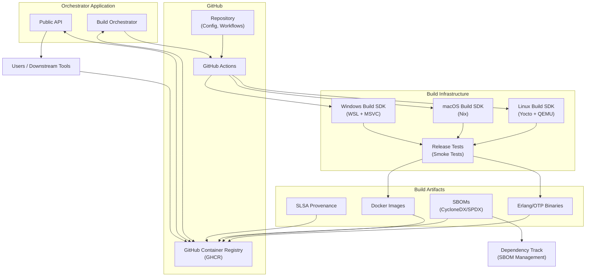
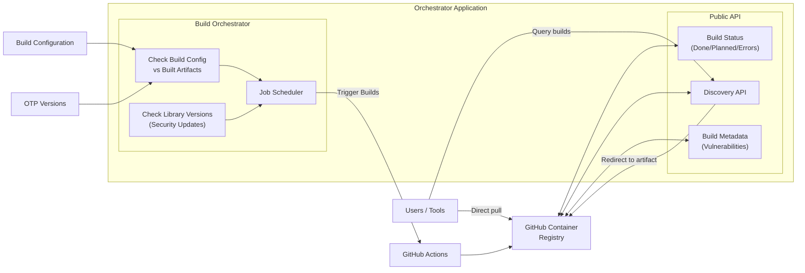
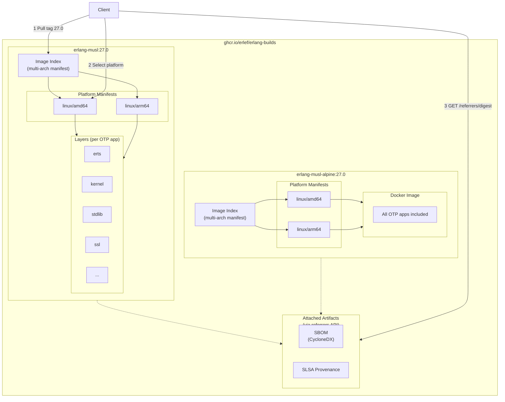

# Erlang Builds

> **Status: Proposal/RFC** - This document outlines a proposal by the
[Erlang Ecosystem Foundation (EEF)](https://erlef.org/) to create a unified
Erlang/OTP binary distribution infrastructure.

## Motivation

The Erlang/OTP binary distribution landscape is fragmented. As the [Current
Providers](#current-providers) table below shows, numerous projects each solve
part of the problem. Some focus on specific platforms, others on particular use
cases, but no single provider offers comprehensive coverage across all operating
systems, architectures, and build configurations.

This fragmentation creates several challenges:

**Difficulty running the latest Erlang release.** Building Erlang/OTP from
source requires installing toolchains, satisfying dependencies, and navigating
platform-specific quirks, many of which are poorly documented. Package managers
like apt, brew, and chocolatey often lag behind official releases by weeks or
months. Users who need a specific version for a specific platform may find no
pre-built binary exists.

**Duplicated effort across downstream projects.** Products built on Erlang,
such as RabbitMQ, Livebook, and tools using Burrito for packaging, must each
solve binary distribution independently. This leads to repeated work and
inconsistent approaches across the ecosystem.

**Regulatory compliance burden.** The EU Cyber Resilience Act (CRA) introduces
requirements for software supply chain transparency, including SBOMs, VEX
disclosures, and timely security patches. Meeting these requirements is simpler
when builds come from a single, well-maintained source rather than a patchwork
of providers with varying practices.

**Lack of a consolidation point.** Without an official, EEF-endorsed
distribution, the ecosystem has no standard to rally around. A central
initiative with a defined maintenance process, not reliant on individual
maintainer availability, gives providers and users a sustainable foundation to
build upon, reducing fragmentation over time.

## Goals

* Provide Central & Official Erlang Binary Distribution for the Ecosystem
  - Endorsed by Erlang, downloadable on erlang.org
* Reduce Fragmentation of the Space through many providers doing a part of the problem
* Provide Build SBoM with builds
* Provide SLSA Provenance with Builds
* Wide Range of supported Arch / OS

## Current Providers

The following tables list some Erlang/OTP providers based on provider types. They are listed here in order
to get a good overview about how Erlang/OTP are being packaged by different OSS vendors.

### Erlang Binary providers

| Provider | Linux x64 | Linux ARM64 | macOS x64 | macOS ARM64 | Windows x64 | Binary | Docker | Notes |
|----------|-----------|-------------|-----------|-------------|-------------|--------|--------|-------|
| [Erlang OTP](https://github.com/erlang/otp) | | | | | ✓ | ✓ | | Official builds |
| [Erlef OTP Builds](https://github.com/erlef/otp_builds) | | | ✓ | ✓ | | ✓ | | |
| [BEAM Machine](https://github.com/doawoo/beam-machine) | ✓ | ✓ | ✓ | ✓ | | ✓ | | MUSL Linux, Fat macOS builds |
| [Erlang Solutions](https://www.erlang-solutions.com/downloads-2/) | ✓ | | ✓ | | ✓ | ✓ | | Ubuntu, Debian, Fedora, CentOS, Raspbian |
| [Hex.pm Bob](https://github.com/hexpm/bob) | ✓ | ✓ | ✓ | ✓ | | ✓ | ✓ | Ubuntu 20.04/22.04/24.04 |
| [Burrito Erlang Builder](https://github.com/burrito-elixir/erlang-builder) | ✓ | ✓ | ✓ | ✓ | ✓ | ✓ | | OTP 25.3+, for Burrito |
| [BEAM runtime](https://meta-erlang.github.io/beamruntime/intro/) | ✓ | ✓ | | | | ✓ | ✓ | runtime relocated based on libc or musl |
| [Alpine Linux](https://pkgs.alpinelinux.org/package/v3.21/community/x86/erlang) | ✓ | ✓ | | | | ✓ | | musl-based, also armhf/armv7/ppc64le/s390x |
| [Docker Erlang OTP](https://github.com/erlang/docker-erlang-otp) | ✓ | ✓ | | | | | ✓ | Official Docker library image |
| [Elixir Desktop Runtimes](https://github.com/elixir-desktop/runtimes) | | | | | | ✓ | | Android & iOS runtimes |
| [Gleam Erlang Linux Builds](https://github.com/gleam-community/erlang-linux-builds) | ✓ | ✓ | | | | ✓ | | glibc, musl, static variants |

### Erlang Source build tools

| Provider | Notes |
|----------|-------|
| [kerl](https://github.com/kerl/kerl) | Easy building and installing of Erlang/OTP instances |
| [asdf erlang plugin](https://github.com/asdf-vm/asdf-erlang) | Erlang plugin for asdf version manager | 
| [mise erlang plugin](https://mise.jdx.dev/lang/erlang.html) | Erlang plugin for mise version manager | 

### Package management

| Provider | Notes |
|----------|-------|
| [nix](https://github.com/NixOS/nixpkgs/tree/nixos-25.11/pkgs/development/interpreters/erlang) | nix package | 
| [erlang chocolatey](https://community.chocolatey.org/packages/erlang) | Erlang package for Windows using https://chocolatey.org/ |
| [brew](https://formulae.brew.sh/formula/erlang) | package for Linux and MacOs|

### Erlang source build for embedded and custom Linux distributions

| Provider | Notes |
|----------|-------|
| [erlang package](https://github.com/buildroot/buildroot/tree/master/package/erlang) | Erlang for buildroot |
| [erlang recipe](https://github.com/meta-erlang/meta-erlang/tree/master/recipes-devtools/erlang) | Erlang recipe for Yocto Project |

### Erlang source/binary package for Operation Systems

| Provider/Operation System| Notes |
|----------|-------|
| [debian](https://tracker.debian.org/pkg/erlang) | |
| [suse](https://packagehub.suse.com/packages/erlang) | |
| [fedora](https://packages.fedoraproject.org/pkgs/erlang/erlang/) | | 
| [freebsd](https://cgit.freebsd.org/ports/tree/lang/erlang) | Also per version [erlang-runtime28](https://cgit.freebsd.org/ports/tree/lang/erlang-runtime28)
| [openbsd](https://github.com/openbsd/ports/tree/master/lang/erlang) | Also per version, 26, 27 and 28 |
| [netbsd](https://ftp.netbsd.org/pub/pkgsrc/current/pkgsrc/lang/erlang/index.html) | single version [support for 27](https://github.com/NetBSD/pkgsrc/tree/trunk/lang/erlang/)|

## Possible Future Consumers

The following tools and projects could potentially integrate with the official Erlang builds. They could use the Discovery API to locate appropriate releases, download binaries directly from the OCI registry, and verify artifact integrity using cosign signatures.

### Version Managers & CI Tools
* [asdf erlang plugin](https://github.com/asdf-vm/asdf-erlang)
* [winget](https://github.com/microsoft/winget-cli)
* [Homebrew](https://github.com/Homebrew/homebrew-core/blob/master/Formula/e/erlang.rb)
* [Elixir install.sh](https://elixir-lang.org/install.sh)
* [Hex.pm Bob](https://github.com/hexpm/bob) consumers
* [erlef/setup-beam GitHub Action](https://github.com/erlef/setup-beam)

### Cross-Architecture Release Builders

Developers building products that ship Erlang releases for multiple target architectures. Using rebar3's `include_erts` option, they can bundle a pre-built Erlang runtime for a different architecture than their build machine (e.g., building on x86-64 but targeting aarch64).

Examples include:
* [RabbitMQ](https://github.com/rabbitmq/rabbitmq-server) - ships releases for multiple platforms
* [OpenRiak](https://github.com/OpenRiak/riak) - distributed database with multi-platform releases
* Any project using rebar3 releases with cross-architecture deployment targets

## Requirements

Not all of those requirements need to be fulfilled to get started.

### Platform Support
* Needs to be able to build at least (not limited to the following list):
  * Linux
    * x86-64
    * aarch64
    * armv7, aarch32
  * macOS
    * aarch64
  * Windows
    * x86-64
* Each supported OS needs to support SBoM. Build Attestations are acceptable
* Needs to be able to build common architectures on the OS
* Ability to easily add new architecture for each OS

### Build Artifacts
* Creates Build SBoMs for Builds
  - [CycloneDX](https://cyclonedx.org/) & [SPDX](https://spdx.dev/) Formats
* Creates verifiable [SLSA](https://slsa.dev/) Provenance for Builds
* Windows builds signed via Azure Trusted Signing
* macOS builds notarized (infrastructure TBD)
* Can build multiple flavors, Examples:
  - Dynamically Linked vs Statically Linked
  - Different Library Support like OpenSSL v1 vs v3
  - FIPS Enabled
  - MUSL / Libc portable (for burrito)

### Lifecycle Management
* Builds are created for each non EOL Erlang Version
* New Build Flavors can be added retroactively for all non EOL versions
* Append Only (old artifacts stay, but tags can be pointed to a newer revision)
* Can rebuild for library updates / security patches

### Infrastructure
* Tracks all Build in a SBoM Management Tool like [Dependency Track](https://dependencytrack.org/)
* Reproducible Builds - Provide a reproducible build platform for the builds (lib versions etc.)
* Offers a Discovery API to locate the right image for the user (OS / Arch, OTP Version, Flavor, Library versions etc.)
* Can profit from free OSS Infrastructure like CI, Storage & CDN

### Release Testing
* Builds undergo release testing to validate outputs before publication
* Full OTP test suite is comprehensive and resource-intensive; only a selected subset runs
* Selected tests verify:
  - Binary functionality (can start BEAM, run basic commands)
  - Platform-specific linking (OpenSSL, ncurses, etc.)
  - Cross-platform consistency
* Tests prove the build works; they don't replace OTP's upstream testing

## Design Proposal



* Using ORAS (OCI Registry As Storage) for Binary Storage / Exchange - https://oras.land/
* Using OCI for Docker Builds
* Using GitHub for
  - Repository containing API, Config, CI Workflows
  - GitHub OCI Registry
* Pluggable Build Infrastructure
  - Using GitHub Actions for initial OS support
  - Other Build Runners can be added using separate Infrastructure, for example if we ever wanted to provide BSD Builds
* Reproducible Build Infra
  - [Linux Build SDK](linux-build-sdk.md) using [Yocto Project](https://www.yoctoproject.org/) and QEMU
  - [Mac Build SDK](mac-build-sdk.md) using [Nix](https://nixos.org/)
  - [Windows Build SDK](windows-build-sdk.md): TBD
* Dependency Track to store all Build SBoM / Track Vulnerabilities
* Support for building intermediate artifacts. For example not all OTP Apps need a recompile for a different infrastructure
* Observer CLI for Build SBoM? - https://docs.sbom.observer/getting-started/observer-cli
* OCI Registry is primary keeper of State, not a database

### API



The project will run an orchestrator application. Its job is twofold:
* Build Orchestrator
  - Check Build Configuration & OTP Versions against built artifacts
    * Schedules jobs to create missing builds
  - Check Library Versions (manual change / security updates) and re-schedules
    builds where necessary
* Public API
  - Build Status (Done / Planned / Errors)
  - Discovery
    * Filter builds by criteria to locate the correct build for a user
    * Provide Redirect to OCI Artifact without needing to understand ORAS on the client
    * Provide metadata for build like vulnerable status

### ORAS Structure



Artifacts are stored in GitHub Container Registry using the
[OCI Distribution Spec](https://github.com/opencontainers/distribution-spec)
(compatible with any OCI registry).

#### Repository Naming
* Binary builds: `ghcr.io/erlef/erlang-builds/erlang-[FLAVOR]` (e.g., `erlang-musl`, `erlang-openssl3`)
* Docker images: `ghcr.io/erlef/erlang-builds/erlang-[FLAVOR]-[BASE]` (e.g., `erlang-musl-alpine`)

#### Structure per Repository
```
ghcr.io/erlef/erlang-builds/erlang-musl:27.0
├── Image Index (multi-arch manifest)
│   ├── linux/amd64 → Image Manifest
│   │   └── Layers (one per OTP app: erts, kernel, stdlib, ssl, ...)
│   └── linux/arm64 → Image Manifest
│       └── Layers (one per OTP app)
└── Attached Artifacts (via OCI referrers API)
    ├── SBOM (CycloneDX)
    └── SLSA Provenance

ghcr.io/erlef/erlang-builds/erlang-musl-alpine:27.0
├── Image Index (multi-arch manifest)
│   ├── linux/amd64 → Docker Image (all apps included)
│   └── linux/arm64 → Docker Image (all apps included)
└── Attached Artifacts
    ├── SBOM (CycloneDX)
    └── SLSA Provenance
```

#### Key Concepts
* **Tag** = OTP version (e.g., `27.0`, `26.2.5`)
* **Image Index** = multi-arch entry point, clients select platform via `Accept` header or registry API
* **Layers** = one layer per OTP application, enabling partial installation for binary builds
* **Attached Artifacts** = SBOMs and attestations linked via `subject` field, discoverable via `/v2/.../referrers/<digest>` API
* **Annotations** = build metadata (workflow, library versions, build timestamp)
